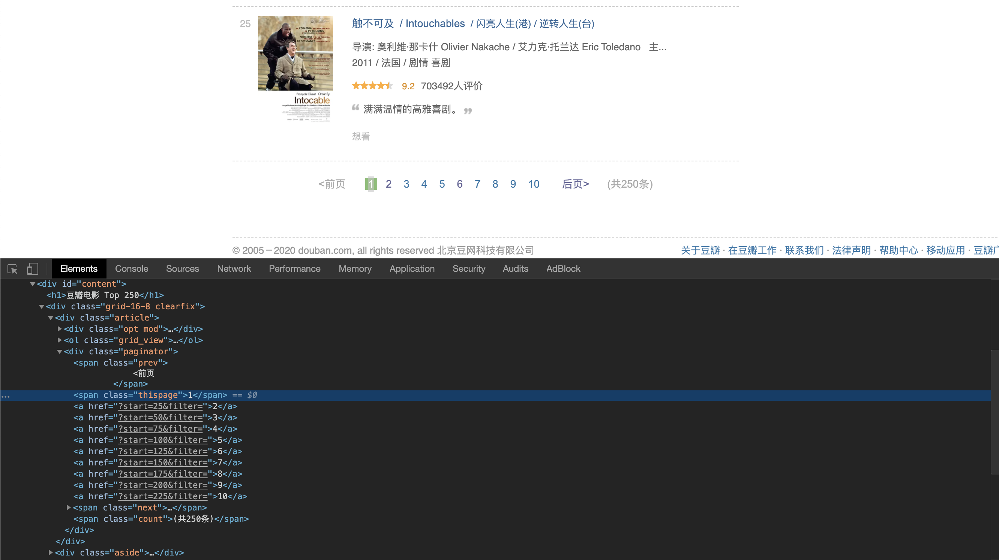
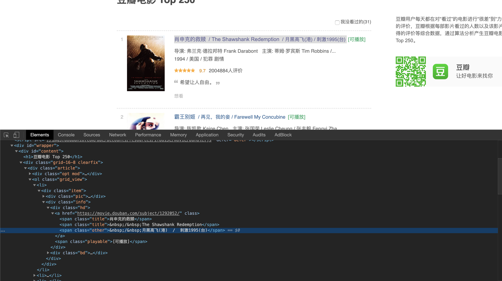
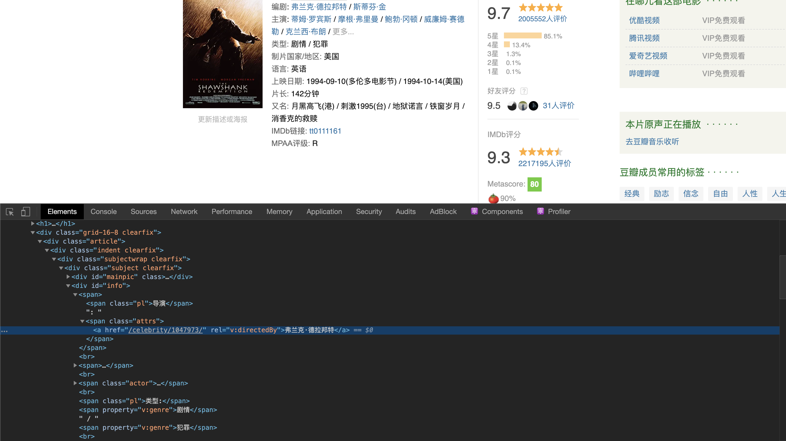

# Douban Film Top 250 Crawler

The script pulls the Top 250 films from [douban](https://movie.douban.com/top250).

## Requirements

- python3
- pip

Install `BeautifulSoup` for parsing html.

```shell
pip install beautifulsoup4
```

## Usage

```shell
git clone https://github.com/alfmunny/douban-film-crawler.git
cd douban-film-crawler
python run.py
```
The films will be written to `films.json` under current folder.

You can also import crawler and run it yourself

```python
from crawler import DouBanFilm250Crawler

film_crawler = DouBanFilm250Crawler()
# only fetch the two pages
film_crawler.start(page_limit=2)
```

## 实现过程

- 一：简单的爬虫
- 二：加入数据库
- 三：反扒机制和如何应对
- 四：顺便搞个Docker部署呗

### 简单的爬虫

目标

1. 爬取豆瓣Top250电影
2. 将信息存入json文件

我们主要用到`requests` and `beautifulsoup4`

`requests` 用来发送请求

`beautifulsoup4` 用来解析返回的html内容，抽取信息

访问根网站，取回html内容。headers是为了让你的访问看起来像是来自浏览器。

```python
class Crawler:
  def __init__(self):
		self.headers = {
  		'User-Agent': 'Mozilla/5.0 (Windows NT 10.0; Win64; x64) AppleWebKit/537.36 (KHTML, like 		Gecko) Chrome/69.0.3497.100 Safari/537.36'
		}
		self.url = 'https://movie.douban.com/top250'

 	def request(self, url):
    response = requests.get(url, headers=self.headers)
    
	def get_base_data(self):
    data = self.request(self.url).text
    return data

```

首先我们需要取得所有需要访问的页面链接。一共有十页，找到页面底部翻页，打开浏览器的Developer Tools。



我们可以看到剩下9页的链接。通过BeautifulSoap抓取出来，放在self.pages里。

```python
def get_pages(self):
  soup = (self.raw_text)
  paginator = soup.find_all("div", class_="paginator") # 通过class的名字找到对应区域
  hrefs = [a.get("href") for a in paginator[0].find_all('a')] # 抽取出所有链接
  self.pages = [ self.url ] + [ self.url + h for h in hrefs ] # 别忘了把第一页也放进去
```

接下来就是遍历self.pages里每个页面，每个页面有25个电影。

主要程序就是一个循环，很简单。

```python
for page in self.pages: # 遍历所有页面 
  film_list = self.get_film_list(page) # 提取单个页面上的25个电影链接 
  for film_page in film_list: # 遍历这些电影
    film = self.get_film(film_page) # 提取电影数据
    self.write_to_json(film) # 保存到文件
```

接下来我们我们来实现其中的 `get_film_list()`， `get_film()`和 `write_to_json()`

首先抓取25个电影链接 `get_film_list()`。



```python
def get_film_list(self, page):
  soup = self._get_soup(page)
  pics = soup.find_all("div", class_="pic")
  return [ pic.a.get("href") for pic in pics ]
```

然后对25个电影链接进行访问，解析数据`get_film()`。点进单个电影的页面，inspect他的元素，比如导演。



我们为每个电影创建一个电影对象，记录下以下数据。

```python
class DoubanFilm:
  def __init__(self):
    self.data = OrderedDict()
```
```python
def get_film(self, film_page):
  soup = self._get_soup(film_page)
  film = DoubanFilm()

  info = soup.find_all('div', id='info')[0].find_all('span')
  
  film.data['rank'] = soup.find_all('span', class_='top250-no')[0].string
  film.data['name'] = soup.find_all('span', property='v:itemreviewed')[0].string
  film.data['directors'] = self._get_tags(info[0].find_all('a'))
  film.data['writers'] = self._get_tags(info[3].find_all('a'))
  film.data['actors'] = self._get_tags(soup.find_all('span', class_="actor")[0].find_all('a'))
  film.data['type'] = self._get_tags(soup.find_all('span', property='v:genre'))
```

最后保存数据到json。`write_to_json()`。

```python
def write_to_json(self, film):
  with open(self.output_file, 'a', encoding='utf8') as output:
    json.dump(film.data, output, ensure_ascii=False, indent=2)
```

### 加入数据库

### 反爬虫机制的应对

###  Docker部署

